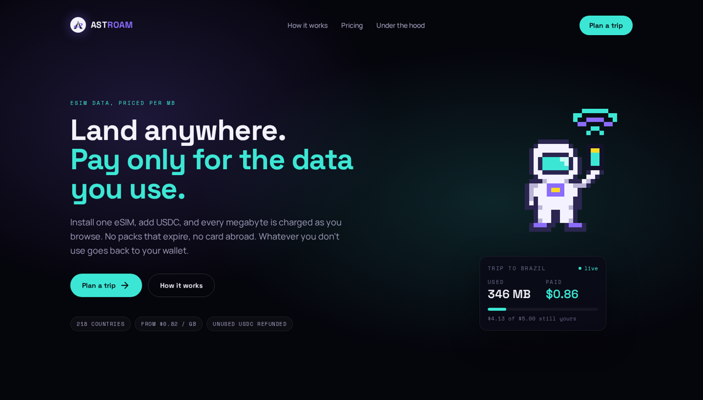
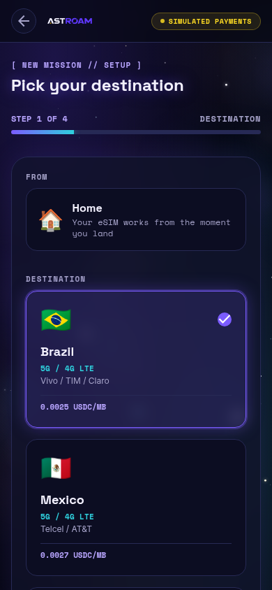
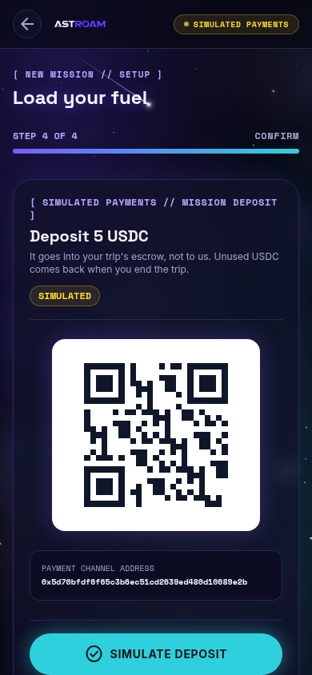
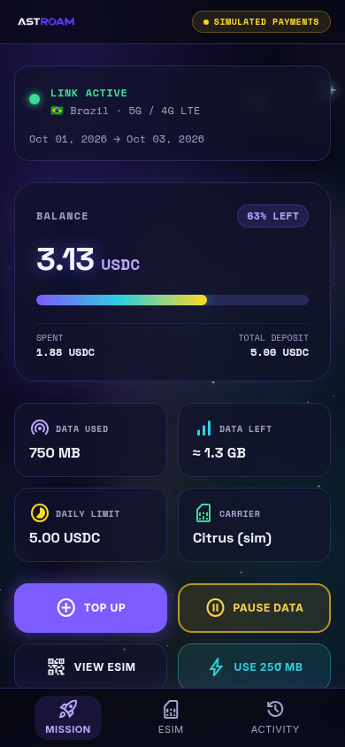
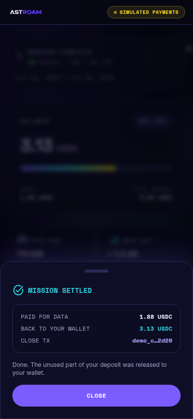

# AstroAm

**Mobile data in any country, paid per MB in USDC. Pay for what you use; get the rest back.**

The traveler deposits USDC into a payment channel and installs one eSIM. As the
carrier meters their data, each reading gets a signed cumulative voucher — no
transaction per megabyte. When the trip ends, one transaction pays AstroAm the
latest voucher and the channel returns the rest of the deposit to the traveler.

Built for **Monad Metropolis 2026** (track: Consumer Products & Payments) by
[@FrancoDuran23](https://github.com/FrancoDuran23), [@DanielPalermoo](https://github.com/DanielPalermoo),
[@ignaMartin22](https://github.com/ignaMartin22) and [@Joel010999](https://github.com/Joel010999).



<table>
  <tr>
    <td></td>
    <td></td>
    <td></td>
    <td></td>
    <td></td>
  </tr>
  <tr><td>Destination &amp; rate</td><td>Deposit</td><td>eSIM</td><td>Trip</td><td>Settled</td></tr>
</table>

## Status — read this first

| Part | State |
|---|---|
| App (landing + trip flow), mission API, metering, cutoff policy, vouchers | **Working**, end to end, with simulated payments and a simulated eSIM |
| Payment channel on Monad: `AstroAmEscrow` contract, `MonadRail`, wallet flow in the app | **Implemented and tested on a local chain** (Foundry + anvil end to end). **Deployed on Monad testnet** at [`0xb357ef37…8292`](https://testnet.monadvision.com/address/0xb357ef379227c4113d3dc439af587437ff3e8292) (v2, with `claim`). Default stays `PAYMENT_RAIL=fake` |
| Citrus Mobile eSIM provider | Implemented, **not yet tested against the real API** (no sandbox; needs a funded reseller account) |

Everything simulated is labeled in the UI ("Simulated payments", "Simulated QR").

## Prior work

This repository starts from AstroAm's base built for another hackathon
(Stellar), imported unchanged in the first commit
([`0ae9756`](https://github.com/FrancoDuran23/astroam-monad/commit/0ae9756)).
Everything after it is new work for Metropolis: Stellar was removed, payments
were moved behind a chain-agnostic `PaymentRail`, the Stellar-era frontend was
translated to English and moved to a dark space theme with a moving starfield,
and the Monad payment channel was added (`contracts/`, `src/rails/MonadRail.ts`,
`frontend/src/chain/monad.ts`).

## How it works

1. **Pick a destination and a budget.** Each country has its own per-MB rate,
   shown up front (Brazil: 0.0025 USDC/MB, so 5 USDC ≈ 2 GB).
2. **Deposit USDC.** From your wallet into the `AstroAmEscrow` contract on
   Monad, not to us. The deposit also registers a session key that this app
   generated in your browser.
3. **Install the eSIM.** One QR or LPA code; it stays on the phone for the next trip.
4. **Browse.** The app signs EIP-712 vouchers with the session key for the
   running total it lets AstroAm charge, a little ahead of usage: no wallet
   popup per MB, nothing on-chain per MB. Data is credited only up to the
   latest voucher (`authorization_required` otherwise); if the deposit can't
   cover a reading, data pauses (`channel_exhausted`).
5. **End the trip.** During the trip AstroAm may claim what the vouchers
   already cover; the escrow stays open. At the end it closes the escrow in
   one transaction: it receives what was actually used, never more than the
   latest voucher, and the rest goes back to your wallet. If AstroAm never
   closes, `refund()` returns whatever was not claimed 30 days after the last
   activity (deposit, top-up or claim).

## Architecture

```
src/
  rails/        PaymentRail port, FakeRail (in-memory) and MonadRail (viem)
  product/      mission API used by the app (/api/missions …)
  meter/        meter: asks for a voucher per reading, credits data only when signed
  services/     cutoff policy, eSIM wallet funding, session close, Citrus webhooks
  providers/    eSIM providers: CitrusProvider (real) and FakeProvider (demo)
  jobs/         usage reconciliation against the carrier
  persistence/  eSIM records and webhook log (JSON files)
  shared/       money math (BigInt), voucher message schemas, retries, network ids
  server/       HTTP app: /health, /ready, /api, /citrus/webhooks
contracts/      AstroAmEscrow.sol + Foundry tests
scripts/        deploy-monad-escrow.ts
frontend/       React + Vite + Tailwind; starfield in components/StarfieldBackground.tsx,
                wallet + session-key vouchers in frontend/src/chain/monad.ts
```

### The Monad escrow

`contracts/src/AstroAmEscrow.sol`, USDC with 6 decimals
(Circle, `0x534b2f3A21130d7a60830c2Df862319e593943A3` on Monad testnet):

| Call | Who | What |
|---|---|---|
| `deposit(escrowId, amount, signer)` | traveler | Locks USDC and registers the app's session key |
| `topUp(escrowId, amount)` | traveler | Adds USDC to the same escrow |
| `claim(escrowId, voucherAmount, signature)` | AstroAm (payee) | Collects the part of the latest voucher not yet paid; the escrow stays open |
| `close(escrowId, voucherAmount, signature, settleAmount)` | AstroAm (payee) | Pays the total `settleAmount` (usage: ≥ already claimed, ≤ the signed voucher) and refunds the rest |
| `refund(escrowId)` | anyone, after the timeout | Returns what was not claimed to the traveler, once the timeout has passed since the last deposit, top-up or claim |

Deployed addresses and the v1 → v2 changes: [`docs/despliegues-monad.md`](docs/despliegues-monad.md).

Vouchers are EIP-712 `Voucher(bytes32 escrowId, uint256 cumulativeAmount)`,
signed by the session key or the traveler's wallet. The API keeps the highest
one per escrow (`DATA_DIR/monad-vouchers-<escrow>.json`).

`PaymentRail` (`src/rails/PaymentRail.ts`) is the only place that knows about
a chain: create a deposit intent, confirm it (the deposit opens the channel),
read the channel deposit, sign vouchers, close and refund. Amounts are BigInt
in an internal raw unit (1 raw = 1e-7 USDC); each rail converts to its token's
decimals.

The background is a Canvas 2D starfield (`frontend/src/components/StarfieldBackground.tsx`):
three parallax layers of twinkling stars, bright stars with a halo and a four-point
sparkle, a drifting band of cosmic dust and the odd shooting star. It follows the
pointer, pauses in hidden tabs and draws a still frame for reduced motion.

## Pricing

Citrus Mobile's public pay-as-you-go rate per country × 1.35.

| Country | Citrus (USD/GB) | AstroAm (USD/GB) | USDC/MB |
|---|---:|---:|---:|
| Brazil | 1.84 | 2.48 | 0.0025 |
| Argentina | 1.89 | 2.55 | 0.0026 |
| Mexico | 2.00 | 2.70 | 0.0027 |
| United States | 0.97 | 1.31 | 0.0013 |
| Spain, Italy, France, UK | 0.61 | 0.82 | 0.0008 |

Rates from [citrusmobile.com/rates](https://citrusmobile.com/rates), checked 2026-09-23.

## Run it locally

Node ≥ 22.18. No keys needed.

```bash
cp .env.example .env
npm install
npm run server                              # API on http://localhost:8080

cd frontend && npm install && npm run dev   # app on http://localhost:5173
```

Leave `frontend/.env` out: Vite proxies `/api` to the backend. On the trip
screen, **Use 250 MB** simulates a carrier reading (5 USDC in Brazil runs out
after 8).

Checks: `npm test` and `npm run check` (backend), `npm test` and `npx tsc --noEmit` (frontend),
`npm run contracts:test` (Foundry). With Foundry installed, `npm test` also runs
`src/rails/MonadRail.anvil.test.ts`: deploy on anvil, deposit, vouchers,
metering, close, balances.

### On Monad testnet

1. Get MON for gas at [faucet.monad.xyz](https://faucet.monad.xyz) (deployer/payee account)
   and test USDC at [faucet.circle.com](https://faucet.circle.com) (traveler wallet).
2. Deploy: `MONAD_DEPLOYER_PRIVATE_KEY=0x… npm run monad:deploy`. The deployer is the payee
   by default.
3. In `.env`: `PAYMENT_RAIL=monad`, `MONAD_ESCROW_ADDRESS=<printed>`,
   `MONAD_PAYEE_PRIVATE_KEY=<payee key>`. Restart the API.
4. In the app, the deposit and top-up buttons open MetaMask or Rabby on Monad testnet.

## Risks, stated plainly

- **Citrus reports usage in USD charged, not bytes.** Bytes are derived from the
  country rate; accuracy needs confirming on a real account.
- **No carrier sandbox.** Every Citrus API test costs real money (minimum top-up USD 4).
- **Citrus also sells directly to travelers, cheaper than us.** We compete on
  paying in USDC without a card and on the automatic refund, not on price.
- **~10 minutes between usage and voucher.** Bounded by the eSIM's prepaid wallet.
- **No audit** of the code or the contract.
- **The session key lives in the browser** (localStorage). Whoever has it can
  authorize charges up to the deposit; clearing the browser loses it, and then
  the trip can only be settled up to the last voucher (the rest is refunded).

## Documents

| Read | For |
|---|---|
| [`docs/decisiones/medicion-con-proveedor.md`](docs/decisiones/medicion-con-proveedor.md) | Why usage is metered by the carrier, not by our own gateway (Spanish). |
| [`docs/citrus-mobile-brief.md`](docs/citrus-mobile-brief.md), [`docs/citrus-mobile-spec.md`](docs/citrus-mobile-spec.md) | The Citrus Mobile integration (Spanish). |
