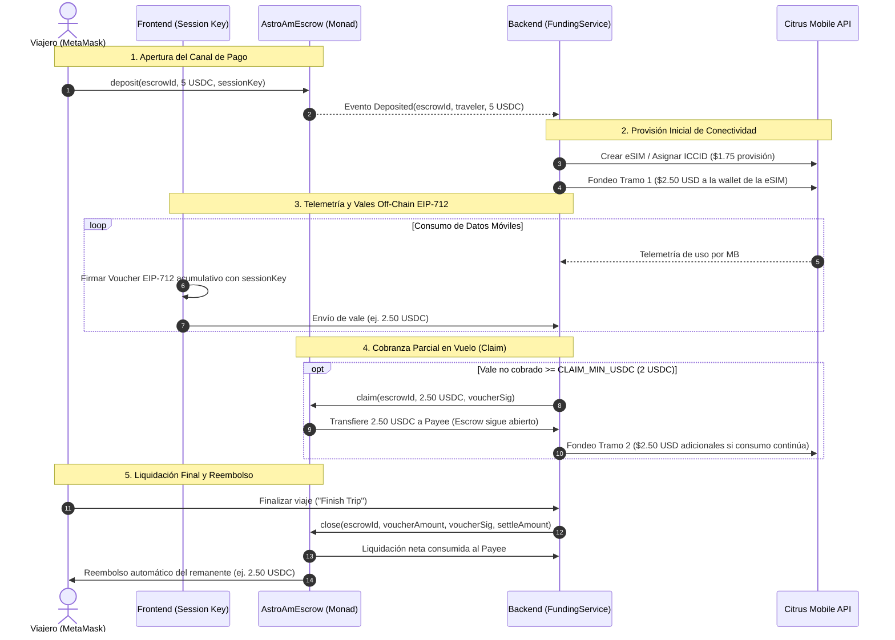

# Arquitectura de Flujo de Fondos en Monad

**Proyecto:** AstroAm · **Ecosistema:** Monad Testnet (Chain ID 10143)  
**Fecha de formalización:** 7/10/2026 · **Hito:** Metropolis Delivery Milestone (13/10/2026)  
**Contrato vigente:** `AstroAmEscrow.sol` v3 (`0xe89893d51180e517e2bf175398aad2e6da82c0f9`)

---

## 1. Resumen Ejecutivo

AstroAm proporciona conectividad móvil internacional (eSIM) pagando por megabyte consumido en USDC, garantizando la devolución inmediata del depósito no utilizado al terminar el viaje.

Este documento establece la arquitectura integral del flujo de fondos de AstroAm en **Monad**, describiendo la interacción entre los canales de pago on-chain (EVM), la emisión de vales criptográficos off-chain (EIP-712), la provisión escalonada de saldo en telecomunicaciones con Citrus Mobile, y la resolución técnica de las decisiones estratégicas de offramp (D-1), alcance de entrega (D-2) y gestión de tesorería/yield (D-3).

---

## 2. Diagrama General del Flujo de Fondos



---

## 3. Componentes del Sistema

### 3.1. Escrow en Monad (`AstroAmEscrow.sol` v3)

El contrato inteligente actúa como custodia fiduciaria descentralizada e inmutable sobre la red Monad Testnet:

- **Red:** Monad Testnet (Chain ID `10143`), beneficiándose de la ejecución paralela y finalidad de sub-segundo de Monad.
- **Token nativo de pago:** USDC de Circle (`0x534b2f3A21130d7a60830c2Df862319e593943A3`, 6 decimales atómicos).
- **Dirección desplegada (v3):** `0xe89893d51180e517e2bf175398aad2e6da82c0f9` ([Ver en MonadVision](https://testnet.monadvision.com/address/0xe89893d51180e517e2bf175398aad2e6da82c0f9)).
- **Payee oficial:** `0xE3E38BE1522E2086B135cb9e9b3D223708485316` (billetera institucional del operador de AstroAm).
- **Mecanismos clave:**
  1. `deposit(bytes32 escrowId, uint256 amount, address signer)`: Bloquea los USDC del viajero y autoriza de forma explícita la clave de sesión (`sessionKey`) que firmará los vales off-chain.
  2. `topUp(bytes32 escrowId, uint256 amount)`: Permite incrementar el presupuesto disponible en el mismo canal sin reiniciar la sesión ni la eSIM.
  3. `claim(bytes32 escrowId, uint256 voucherAmount, bytes signature)`: Permite al operador retirar fondos acumulados ya cubiertos por un vale firmado sin cerrar el canal (`voucherAmount - claimed`).
  4. `close(bytes32 escrowId, uint256 voucherAmount, bytes signature, uint256 settleAmount)`: Liquida el uso final real (`settleAmount`), transfiere la diferencia pendiente al payee y reembolsa de inmediato e incondicionalmente el saldo restante (`deposit - settleAmount`) a la billetera del viajero.
  5. `refund(bytes32 escrowId)`: Mecanismo de seguridad "dead-man switch". Si transcurren 30 días (`MONAD_TIMEOUT_SECONDS = 2592000`) desde la última actividad sin que el operador haya cerrado el canal, el viajero (o cualquier tercero) puede reclamar el retorno del 100% de los fondos no reclamados (`deposit - claimed`).

### 3.2. Vales Off-Chain EIP-712 y Claves de Sesión

Para eliminar la fricción de requerir aprobaciones en MetaMask por cada megabyte de datos, AstroAm utiliza vales acumulativos fuera de cadena:

- **Estándar:** EIP-712 (Typed Structured Data).
- **Estructura del dominio:**
  - `name`: `"AstroAmEscrow"`
  - `version`: `"1"`
  - `chainId`: `10143`
  - `verifyingContract`: `0xe89893d51180e517e2bf175398aad2e6da82c0f9`
- **Mensaje firmado:** `Voucher(bytes32 escrowId, uint256 cumulativeAmount)`.
- **Gestión de clave de sesión:**
  - El frontend genera un par de claves efímero local (`secp256k1`) al iniciar el viaje.
  - La clave privada se resguarda exclusivamente en el navegador (`localStorage`).
  - La clave pública se envía en la transacción de `deposit`.
  - El backend valida criptográficamente cada vale con `ecrecover`, verificando que el firmante coincida con la `sessionKey` o con la wallet del viajero (`travelerAddress`).
- **Buffer de autorización:**
  - A medida que el dispositivo consume datos, el frontend firma vales acumulativos ligeramente por encima del consumo estricto para asegurar continuidad de red sin latencia.
  - En caso de cierre o interrupción prematura, el contrato protege al viajero: el operador **nunca** puede liquidar por encima del último vale firmado, y el reembolso remanente es automático.

### 3.3. Tramos hacia Citrus Mobile (`FundingService`)

Citrus Mobile opera bajo un modelo de prepago: cada eSIM cuenta con una billetera virtual que debe ser fondeada en USD antes de que los operadores móviles locales enruten paquetes de datos.

- **Fondeo escalonado (Tranches):**
  - Para minimizar el riesgo de capital de AstroAm, no se transfiere todo el depósito del viajero a Citrus de forma inmediata.
  - Se utiliza una política de tramos configurada en:
    - `FUNDING_TRANCHE_CENTS = 250` ($2.50 USD por tramo).
    - `FUNDING_MIN_CENTS = 50` ($0.50 USD umbral mínimo para ejecutar una recarga).
- **Regla pura de fondeo (`nextFundCents`):**
  ```typescript
  nextFundCents = min(
    FUNDING_TRANCHE_CENTS,
    max(0, valesCubiertosUSD + FUNDING_TRANCHE_CENTS - yaFondeadoUSD),
    depositoRestanteUSD
  )
  ```
- **Límite de pérdida máxima (Worst-case loss):**
  - Si un viajero cierra la app, borra su navegador o se niega a firmar vales tras consumir su primer paquete, la pérdida máxima asumida por el operador está acotada estrictamente a **un tramo ($2.50 USD)**, en lugar del total del depósito (ej. $10 o $20 USD).
- **Supervisión de Saldo Reseller de Citrus (C1-C3):**
  - El backend verifica periódicamente el saldo de la cuenta reseller (`CITRUS_RESELLER_LOW_BALANCE_USD = 20`).
  - Si el saldo disponible no alcanza para cubrir el costo de provisión de la eSIM ($1.75 USD) más el primer tramo de fondeo ($2.50 USD), el backend frena la creación de nuevas misiones informando al usuario y alertando a operaciones para evitar fallos de conectividad en el destino.

### 3.4. Liquidación y Reembolso al Cierre

El ciclo concluye mediante dos mecanismos complementarios:

1. **Cierre Activo por el Operador (`close`):**
   - Disparado cuando el viajero pulsa "Finish Trip" o cuando el job de conciliación detecta que el depósito se ha agotado o expiró la ventana de gracia (`ESCROW_TRIP_END_GRACE_SECONDS = 86400`).
   - El backend toma la lectura de consumo real final (`consumedUsdc`), el último vale acumulado firmado (`voucherAmount`), y envía la transacción de `close`.
   - El contrato transfiere `settleAmount - claimed` a la cuenta payee del operador y transfiere `deposit - settleAmount` directamente al viajero.
2. **Reembolso por Timeout (`refund`):**
   - Garantía descentralizada de no-custodia permanente. Si el backend sufriera una caída catastrófica, el contrato permite a cualquiera ejecutar `refund(escrowId)` a los 30 días de la última actividad (`lastActivityAt`), devolviendo todos los fondos remanentes al viajero.

---

## 4. Resolución Formal de Decisiones (D-1, D-2, D-3)

### Decisión D-1: Estrategia de Offramp (USDC a USD Fiat)

* **Problema:** En la implementación paralela de Solana se contempló Bridge.xyz (`BridgeClient`) para conversión directa de USDC a cuentas bancarias ACH/SEPA vinculadas a las tarjetas de débito/crédito corporativas que fondean Citrus. En Monad Testnet, Bridge y Circle Mint no ofrecen soporte nativo directo para transferencias fiat automatizadas.
* **Resolución Oficial:** Estrategia bifásica (Híbrida → Automatizada):
  1. **Fase 1: Piloto y Lanzamiento Metropolis (Actual):**
     - El contrato `AstroAmEscrow` acumula los USDC netos generados por los cobros (`claim` y `close`) en la billetera payee del operador (`0xE3E38BE1522E2086B135cb9e9b3D223708485316`).
     - Para la reposición de fiat en las tarjetas de crédito de Citrus, el operador realiza swaps cross-chain periódicos hacia redes EVM compatibles con Bridge (ej. Base o Arbitrum) o liquida vía un exchange centralizado (CEX) regulado.
     - Esta aproximación desacopla la experiencia del viajero (que es 100% instantánea y en USDC) de los raíles bancarios tradicionales.
  2. **Fase 2: Mainnet Roadmap (Post-Hackathon):**
     - Activar el módulo automático de tesorería (`TREASURY_SWEEP_MIN_USDC`) conectando directamente los depósitos con Bridge.xyz o Circle Mint en cuanto desplieguen sus contratos oficiales y raíles fiduciarios sobre Monad Mainnet.

### Decisión D-2: Alcance Cerrado para la Entrega Metropolis (13/10/2026)

* **Problema:** Delimitar con exactitud qué componentes forman parte de la entrega final operativa para el hackathon vs. características diferidas.
* **Resolución Oficial:** Alcance cerrado y completado:
  - **Componentes en Producción / Verificados:**
    - Contrato `AstroAmEscrow.sol` v3 desplegado en Monad Testnet (`0xe89893d51180e517e2bf175398aad2e6da82c0f9`), con soporte para `deposit`, `topUp`, `claim`, `close`, `refund` y compatibilidad EIP-712.
    - Orquestador de backend en TypeScript con `MonadRail`, telemetría de red, fondeo escalonado por tramos (`FUNDING_TRANCHE_CENTS = 250`), `claim` periódico automático (`CLAIM_MIN_USDC = 2`) y auto-cierre por timeout/agotamiento.
    - Gating de balance reseller en Citrus (`CITRUS_RESELLER_LOW_BALANCE_USD = 20`) y procesamiento de webhooks.
    - Frontend Web3 con selector de destino, presupuestos en USDC, conexión nativa con MetaMask, almacenamiento seguro de sesión efímera, firma silenciosa y advertencias explícitas en dispositivos móviles.
    - Prueba End-to-End verificada on-chain en Monad Testnet.
  - **Componentes Diferidos a Roadmap Post-Metropolis:**
    - Sweep bancario automatizado (`B6`): supeditado a la disponibilidad de offramp nativo en Monad según D-1.
    - Recarga de cuenta reseller de Citrus mediante transferencia bancaria programada vía API (sujeto a respuesta del equipo de soporte de Citrus).

### Decisión D-3: Política de Rendimiento / Yield

* **Problema:** En redes como Solana se evaluó integrar Kamino Finance para generar intereses sobre el depósito del viajero durante viajes largos.
* **Resolución Oficial: Exclusión total de protocolos de yield en Monad para la versión actual.**
  - **Justificación de Seguridad:** En Monad Testnet los protocolos de préstamo y rendimiento (lending markets) se encuentran en fases de prueba tempranas y no auditadas. Incorporar un protocolo de yield externo en el flujo de custodia del escrow introduciría riesgo de liquidación, riesgo de oráculo y riesgo de contrato inteligente innecesario para un producto enfocado en pagos y conectividad.
  - **Experiencia de Usuario:** La prioridad crítica para el viajero es la certeza absoluta de que su reembolso no consumido esté disponible de forma instantánea al presionar "Finish Trip". Bloquear fondos en protocolos de yield con posibles demoras de desapalancamiento afectaría la inmediatez del reembolso.
  - **Roadmap Mainnet:** Cuando protocolos consolidados (como Aave v3 o Morpho Blue) estén formalmente desplegados y auditados en Monad Mainnet, se evaluará una estrategia de tesorería opcional (`YieldStrategy`) para saldos ociosos que superen un umbral temporal establecido.

---

## 5. Resumen de Parámetros de Operación

| Parámetro | Variable de Entorno | Valor Predeterminado | Propósito |
|---|---|---|---|
| Red / Chain ID | `MONAD_CHAIN_ID` | `10143` | Monad Testnet |
| Contrato Escrow | `MONAD_ESCROW_ADDRESS` | `0xe89893d51180e517e2bf175398aad2e6da82c0f9` | Dirección oficial v3 |
| Token de Pago | `MONAD_USDC_ADDRESS` | `0x534b2f3A21130d7a60830c2Df862319e593943A3` | Circle USDC (6 decimales) |
| Timeout Reembolso | `MONAD_TIMEOUT_SECONDS` | `2592000` (30 días) | Ventana inactividad dead-man |
| Tamaño de Tramo | `FUNDING_TRANCHE_CENTS` | `250` ($2.50 USD) | Límite por recarga a la eSIM |
| Umbral Mínimo Tramo | `FUNDING_MIN_CENTS` | `50` ($0.50 USD) | Brecha mínima para recargar |
| Umbral Mínimo Claim | `CLAIM_MIN_USDC` | `2` (2 USDC) | Cobro on-chain en vuelo |
| Margen Auto-cierre | `ESCROW_CLOSE_MARGIN_SECONDS` | `86400` (24 horas) | Cierre preventivo previo a timeout |
| Gracia Fin de Viaje | `ESCROW_TRIP_END_GRACE_SECONDS`| `86400` (24 horas) | Cierre tras fecha pactada |
| Alerta Saldo Citrus | `CITRUS_RESELLER_LOW_BALANCE_USD`| `20` ($20 USD) | Umbral preventivo de revendedor |
| Costo Provisión eSIM | `CITRUS_ESIM_PROVISION_CENTS`| `175` ($1.75 USD) | Reserva mínima por eSIM |
