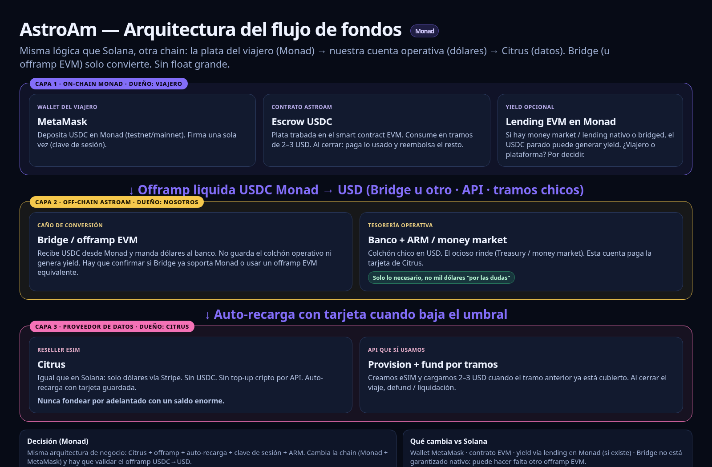

# Decisión: Citrus + offramp para automatizar el flujo de fondos (Monad)

**Fecha:** 5/10/2026 · **Estado:** decisión de diseño, sin implementar · **Cadena:** Monad (EVM)

Misma lógica de negocio que en Solana
([PR en astroam-solana](https://github.com/FrancoDuran23/astroam-solana/pull/2)):
escrow del viajero arriba, dólares en el medio, Citrus abajo. Acá cambia la
wallet (**MetaMask**), el escrow (**contrato EVM** en
`contracts/src/AstroAmEscrow.sol`) y el offramp: Bridge no está asegurado
como nativo en Monad; hay que validar la ruta USDC Monad → USD antes de
fijar el proveedor.

Contexto de producto ya decidido: medición con el proveedor
([`medicion-con-proveedor.md`](medicion-con-proveedor.md)) y el modelo Citrus
([`../citrus-mobile-brief.md`](../citrus-mobile-brief.md)).

## 1. Problema

AstroAm vende datos móviles prepago. El viajero deposita **USDC** en un
escrow on-chain (en Monad: contrato EVM + MetaMask). El uso se mide
off-chain. Un cierre paga a AstroAm lo usado y devuelve el resto al viajero.

Citrus cobra en **dólares vía Stripe**. No acepta USDC ni otra crypto. No hay
top-up del saldo reseller por API (solo dashboard; mínimo ~$10 en docs).
Fondear eSIMs sí es API: `POST /esim/{iccid}/fund`. Sí existe
**auto-recarga con tarjeta guardada** cuando baja el saldo
(`balance.auto_refill_succeeded` / `failed`).

La eSIM del viajero tiene que seguir **standalone** (no meterla en un grupo
compartido solo para disparar auto-refill).

Hoy el lazo no cierra solo: AstroAm adelanta USD a Citrus y recién cobra
USDC al close. El USDC no vuelve solo a dólares.

## 2. Solución recomendada (misma lógica que Solana)

```
Viajero (MetaMask) ─USDC─▶ Escrow Monad (EVM)
                              │ depósito (una firma)
                              ▼
                        backend provisiona la eSIM
                        y fondea un tramo chico
                        POST /esim/{iccid}/fund
                              │
                              ▼
               saldo reseller de Citrus ──auto-refill──▶ tarjeta guardada
                              ▲                                    │
                              │                                    ▼
                        USD en el banco ◀── offramp liquida USDC
                              ▲              (treasury / close)
                              │
                        close: paga lo usado, devuelve el resto
```

1. El viajero deposita USDC en el escrow Monad.
2. El backend fondea tramos chicos ($2–$3) en Citrus.
3. Auto-recarga con tarjeta repone el saldo reseller.
4. Al close (y barrido de tesorería), el USDC cobrado va a un offramp que
   deposita USD en el banco que respalda esa tarjeta.

### Offramp en Monad (punto abierto)

En Solana la decisión fija **Bridge** (liquidation address Solana/USDC,
mínimo ~$1, orquestación orientativa ~0,25%). En Monad:

| Opción | Rol | Estado |
|--------|-----|--------|
| **Bridge** u otro con ruta Monad USDC → USD | Liquidation address / ACH-wire | **Validar** si existe ruta Monad; si no, bridgeear USDC a Solana/Ethereum y liquidar ahí |
| **Circle Mint** | USDC → banco (wire/RTP) | Alternativa; más enterprise / KYB |
| **Rain** | Visa virtual fondeada con USDC | Podría pagar Stripe de Citrus directo; más KYC |

**No inventar** comisiones ni soporte Monad de Bridge: el paso (1) de
próximos pasos es validar la ruta.

Capa Citrus (Stripe, auto-refill, API fund) **no cambia** respecto de Solana.

## 3. Alternativas evaluadas

Igual que en Solana: no migrar a **Cryptorefills** ni **ZeroID** mientras el
diferenciador sea reembolsar MB no usados (esas opciones cobraran el producto
entero o prepago grande, sin pay-per-MB con devolución).

## 4. Escrow (Monad / EVM)

Contrato: `contracts/src/AstroAmEscrow.sol`.

Riesgo análogo al de Solana: si solo el viajero puede firmar el close, y hay
timeout de reembolso total, AstroAm puede perder lo ya fondeado en Citrus.

**Producto.** Al depositar se registra una **clave de sesión** (o equivalente
EVM: session key / permit / operador autorizado). El viajero firma una vez;
el backend cierra con esa autoridad. Tope = depósito.

**Tramos de $2–$3.** Solo se fondea el siguiente tramo en Citrus cuando un
vale cubre el anterior. Pérdida máxima si el viajero desaparece: **un tramo**.

**Claims parciales.** Un `claim` mueve a AstroAm lo acumulado sin cerrar el
escrow, para viajes largos / timeout.

**Yield (opción abierta).** Mientras el USDC está en escrow, evaluar lending
EVM en Monad (o en la cadena del offramp) — **desconocido** qué protocolos
están maduros; no implementar en esta decisión. Queda abierto a quién va el
yield (viajero vs plataforma).

**Demo.** Firmas MetaMask periódicas sin cambiar el contrato alcanzan para
mostrar el ciclo; no escalan.

## 5. Decisión

Quedarse con **Citrus + offramp (validar Bridge u equivalente en Monad) +
auto-recarga con tarjeta + session key / claims parciales + tramos**.



*Arquitectura en capas: viajero y escrow Monad arriba, offramp y banco en el
medio, Citrus abajo. Material de referencia; el proveedor de offramp y sus
comisiones en Monad siguen por validar (sección 2).*

Próximos pasos:

1. Validar offramp USDC en Monad (¿Bridge u otro? ¿hay que saltar a otra
   cadena?). Abrir cuenta y crear la dirección de liquidación hacia el banco
   de AstroAm.
2. Configurar en Citrus la tarjeta guardada y la auto-recarga.
3. Especificar el cambio del contrato de escrow: session key al depositar y
   claims parciales. El demo puede seguir con firmas MetaMask.
4. Escribir a support@citrusmobile.com: ¿wire/ACH/crypto? ¿auto-recarga del
   account sin grupo compartido?
5. Evaluar yield EVM en un diseño aparte, incluido a quién se asigna.

## Enlaces

- Bridge: https://bridge.xyz
- Liquidation address: https://apidocs.bridge.xyz/platform/orchestration/liquidation_address/liquidation_address
- Payment routes: https://apidocs.bridge.xyz/get-started/introduction/what-we-support/payment-routes
- Circle Mint: https://developers.circle.com/circle-mint
- Rain: https://www.rain.xyz
- Cryptorefills: https://www.cryptorefills.com
- ZeroID reseller: https://zeroid.to/reseller
- Citrus developer docs: https://citrusmobile.com/developer/docs
- Decisión gemela Solana: https://github.com/FrancoDuran23/astroam-solana/pull/2
